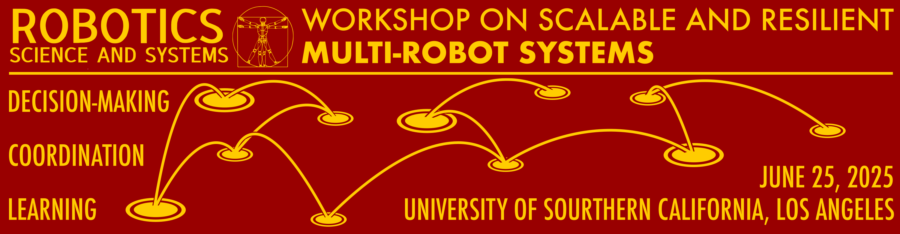

Here is the github repo for RSS 2025 Workshop on Scalable and Resilient Multi-Robot Systems: Decision-Making,
Coordination, and Learning. Below we describe some basics of how to edit and view the website.

## Seeing the Website

The current version on GitHub can be seen at [the following link](http://mrs-workshop.github.io):

```
http://mrs-workshop.github.io/
```

## Editing the Website

After you clone the repo, you can just make edits in a text editor like VSCode. All HTML elements (structure) are in corresponding `index.html` files. The one in the base directory is the main page, and then all the others are on their corresponding subdirectories (e.g. `registration/index.html` has the registration page). All style is handled by `assets/main.css`, so edit this to change things like font size/space, inheritance, etc.

To see your changes in real time, just run 

```
python -m http.server
```

in the base directory. Then you should be able to see changes at `http://localhost:8000`. If changes don't seem to be taking effect (especially changing things like images), try opening the page in an incognito browser or clearing your cache first.

## Style and Colors

In keeping with RSS 2025's location at USC, I think it could be nice to stick with the [style guide given by USC](https://identity.usc.edu/identity/color/), which specifies primary/secondary/tertiary colors and effective color combinations. It will also enable cohesion with the central [RSS Website](https://roboticsconference.org/), which is a plus!